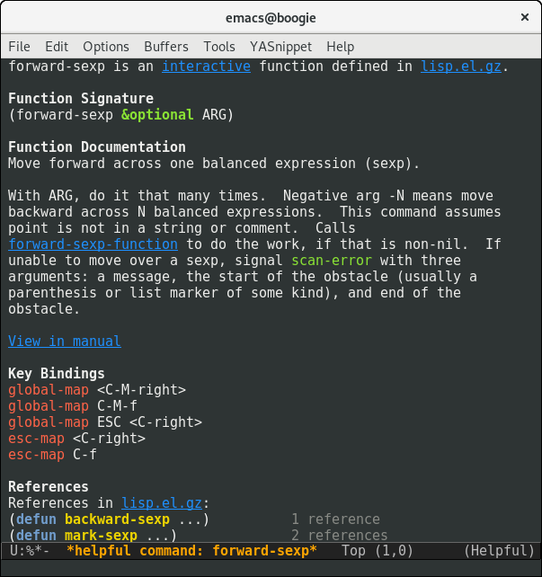
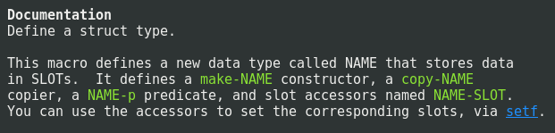

# Helpful    

Helpful is an alternative to the built-in Emacs help that provides
much more contextual information.

## Features

### Source code

Helpful will try really hard to show the source code. It shows the
source code for interactively defined functions (unlike the built-in
Help) and falls back to the raw sexp if no source is available.

### View Callers

Helpful will show you where a function is being called!

### Prettier Docstrings

Docstrings in helpful:

* Highlight the summary (the first sentence)
* Include cross-references
* Hide superfluous puncuation

### Symbol Properties

Helpful will show you the properties that have been applied to the
current symbol. This provides visibility of features
like edebug or byte-code optimisation.

### Describe Commands

Helpful provides a separate `helpful-command` function, for when you
just want to view interactive functions.

### View Keymaps

Helpful displays any keybindings that apply to interactive functions.

### Integrated Tooling

You can trace, debug (coming soon) or disassemble functions from inside
Helpful. This is discoverable and doesn't require memorisation of
commands.

## Inspirations

This project has been heavily influenced by:

* [help+.el](https://www.emacswiki.org/emacs/help+.el), help-fns+.el, help-mode+.el
* [Dave Williams' demo of Lucid's Energize](https://www.youtube.com/watch?v=pQQTScuApWk)
