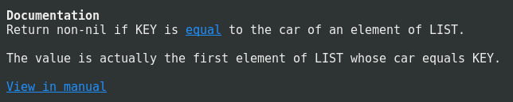

# Helpful [](https://coveralls.io/github/Wilfred/helpful?branch=master) [](http://melpa.org/#/helpful) [](https://github.com/Aaronepower/tokei)

Helpful is an alternative to the built-in Emacs help that provides
much more contextual information.


## Usage

Install from MELPA, then call one of the following commands:

* `helpful-callable`
* `helpful-function`
* `helpful-macro`
* `helpful-command`
* `helpful-key`
* `helpful-variable`
* `helpful-at-point`

If you want to replace the default Emacs help keybindings, you can do
so:

``` emacs-lisp
;; Note that the built-in `describe-function' includes both functions
;; and macros. `helpful-function' is functions only, so we provide
;; `helpful-callable' as a drop-in replacement.
(global-set-key (kbd "C-h f") #'helpful-callable)

(global-set-key (kbd "C-h v") #'helpful-variable)
(global-set-key (kbd "C-h k") #'helpful-key)
```

I also recommend the following keybindings to get the most out of
helpful:

``` emacs-lisp
;; Lookup the current symbol at point. C-c C-d is a common keybinding
;; for this in lisp modes.
(global-set-key (kbd "C-c C-d") #'helpful-at-point)

;; Look up *F*unctions (excludes macros).
;;
;; By default, C-h F is bound to `Info-goto-emacs-command-node'. Helpful
;; already links to the manual, if a function is referenced there.
(global-set-key (kbd "C-h F") #'helpful-function)

;; Look up *C*ommands.
;;
;; By default, C-h C is bound to describe `describe-coding-system'. I
;; don't find this very useful, but it's frequently useful to only
;; look at interactive functions.
(global-set-key (kbd "C-h C") #'helpful-command)
```

[Ivy](https://github.com/abo-abo/swiper) users can use Helpful with
counsel commands:

``` emacs-lisp
(setq counsel-describe-function-function #'helpful-callable)
(setq counsel-describe-variable-function #'helpful-variable)
```

## Features

### Source code


Helpful will try really hard to show the source code. It shows the
source code for interactively defined functions (unlike the built-in
Help) and falls back to the raw sexp if no source is available.

### View Callers


Helpful will show you where a function is being called!

### Prettier Docstrings


Docstrings in helpful:

* Highlight the summary (the first sentence)
* Include cross-references to other functions/variables
* Linkify references to Info nodes
* Hide superfluous punctuation



If a symbol is also documented in the Info manual, helpful will
provide a link to the relevant section too.

### Symbol Properties


Helpful will show you the properties that have been applied to the
current symbol. This provides visibility of features
like edebug or byte-code optimisation.

Helpful will also highlight any symbol aliases.

### Describe Commands

Helpful provides a separate `helpful-command` function, for when you
just want to view interactive functions.

### View Keymaps


Helpful displays any keybindings that apply to interactive functions.

### Integrated Tooling


You can trace, debug or disassemble functions from inside
Helpful. This is discoverable and doesn't require memorisation of
commands.

### Aliases


If a function has multiple aliases in Emacs, Helpful will show all of
the aliases defined.

## Inspirations

This project has been heavily influenced by:

* [help+.el](https://www.emacswiki.org/emacs/help+.el), help-fns+.el, help-mode+.el
* [Dave Williams' demo of Lucid's Energize](https://www.youtube.com/watch?v=pQQTScuApWk)

## License

GPLv3+.

I am providing code in the repository to you under an open source
license. Because this is my personal repository, the license you
receive to my code is from me and not my employer.
